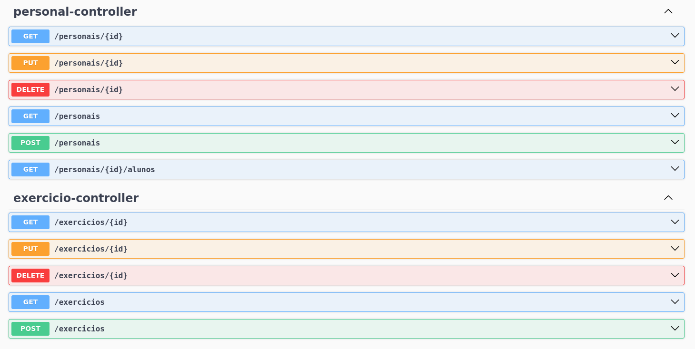
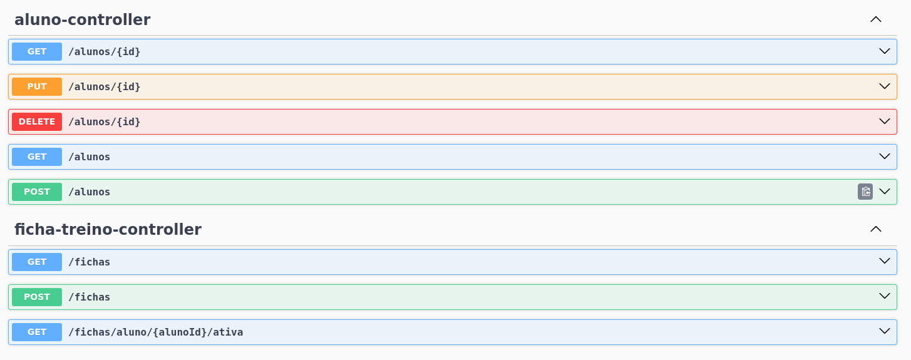
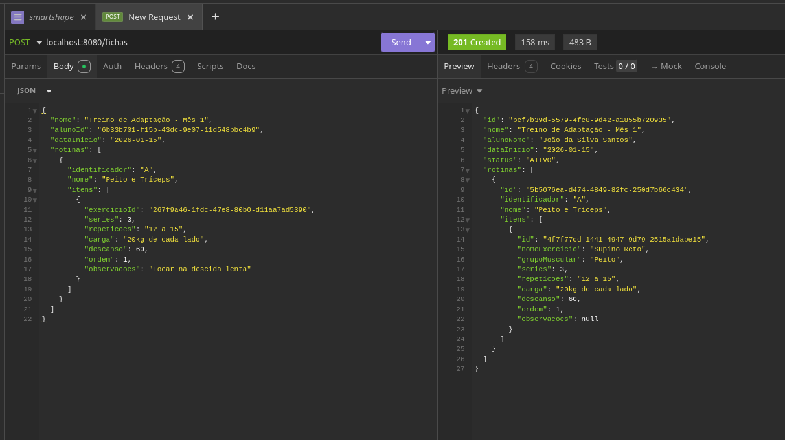
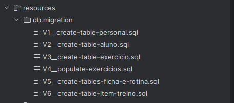

# 🏋️ SmartShape API

API robusta para gestão de treinos, desenvolvida com Spring Boot 3. Este projeto serve como a base técnica para uma plataforma de acompanhamento de alunos por Personal Trainers.

## 📸 Demonstração da API (Swagger)

Abaixo, a interface do Swagger documentando todos os endpoints funcionais da parte pública do sistema:

## 🛠️ Funcionalidades Core

### 1. Montagem de Fichas Complexas
O sistema permite a criação de uma ficha completa em uma única requisição, vinculando múltiplas rotinas e exercícios de forma atômica.

### 2. Catálogo de Exercícios com Vídeo
Cada exercício cadastrado possui suporte para URL de vídeo demonstrativo, facilitando a execução correta pelo aluno.

## 🏗️ Decisões de Arquitetura

- **Data Transfer Objects (DTOs):** Uso de Records do Java para imutabilidade e segurança no tráfego de dados.
- **Global Exception Handling:** Tratamento padronizado de erros para fornecer feedbacks claros ao cliente da API.

## 🚀 Como Executar
1. Clone o repositório.
2. Certifique-se de ter o PostgreSQL rodando (ou altere para H2 no application.yml).
3. Execute `mvn spring-boot:run`.
4. Acesse: `http://localhost:8080/swagger-ui/index.html`

## 🐳 Infraestrutura e Banco de Dados

### 1. Docker & Docker Compose
O projeto está preparado para rodar em containers, facilitando o setup do ambiente de desenvolvimento. O arquivo `docker-compose.yml` gerencia o banco de dados PostgreSQL, garantindo que a aplicação esteja pronta para uso com um único comando.

### 2. Migrations com Flyway
Utilizo o **Flyway** para o versionamento do esquema do banco de dados. Isso garante que todas as alterações na estrutura (tabelas, colunas, constraints) sejam aplicadas de forma consistente e automática em qualquer ambiente.

